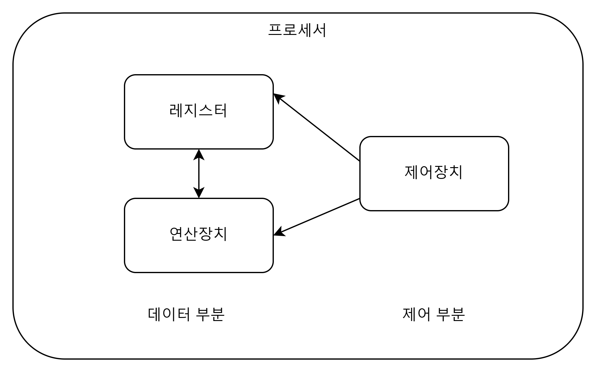

# 운영체제
### 운영체제란?
`컴퓨터 자원들을 효율적으로 관리 -> 사용자에게 서비스를 제공하는 소프트웨어`

## 컴퓨터 하드웨어

- 프로세서
  - CPU
  - GPU
  - 응용 전용 처리장치

- 메모리
  - 주 기억장치 ex) DRAM
  - 보조기억장치 ex) Disk
  
- 주변장치
  - 키보드 , 마우스 , 모니터, 네트워킹 모뎀등..

___

### 프로세서

### 레지스터 
  - 프로세서 내부에 있는 메모리
  - 프로세서가 사용할 데이터 저장
  - 컴퓨터에서 가장 빠른 메모리
#### 레지스터 구별하기
1. 용도에 따른 분류
   - 전용 레지스터
   - 범용 레지스터
2. 변경 여뷰에 따른 분류
   - 가시 레지스터
     - 데이터 레지스터
     - 주소 레지스터
   - 불가시 레지스터
     - `프로그램 카운터`
     - `명령어 레지스터`
     - `누산기`
3. 저장하는 정보종류에 따른 분류
   - 데이터 레지스터, 주소 레지스터, 상태 레지스터
___
### 메모리
메모리는 데이터를 저장하는 장치이다 (프로그램이나 사용자 데이터 등등..)

#### 종류

#### 주 기억 장치(Main Memory)
- 프로세서가 수행할 프로그램과 데이터 저장 
- DRAM 사용
- 디스크 입출력 병목현상 해소해줌
  - 메모리를 cpu와 disk의 사이에 넣어주면서 속도차이를 매꿔준다

#### 캐시
- cpu안에 있음
- 레지스터와 차이점은?
  - cpu 코어에 레지스터 보다 멀리있다
  - 메인메모리와 cpu의 병목현상을 해소해준다 

#### 캐시의 동작
일반적으로 HW적으로 관리된다

##### 캐시미스란?
    cpu가 데이터를 필요로 할 때 캐시에 데이터가 없는 것을 말함
    이렇게 되면 cpu가 메모리에서 데이터를 가져와야함
##### 캐시히트란?
    cpu가 데이터를 필요로 할 때 캐시에 데이터가 있는 상황
    메인메모리에 접근할 필요가 없다

캐시의 용량이 작은데 캐시히트로 효과를 볼 수 있을까?

`지역성(Locality)`
- 공간지역성 : 한번 어떤 주소를 참조하면 다음번엔 그 주소 근처를 참조 할 가능성이 있다
- 시간 지역성 : 최근에 참조된 주소는 곧 다음에 다시 참조된다

#### 보조 기억 장치
- 프로그램 데이터를 저장
- 프로세서가 직접 접근 x 메모리에 올려서 사용한다
- 용량이 크고 가격이 저렴하다

___

### 주변장치
프로세서와 메모리를 제외한 하드웨어  
보조기억장치도 주변장치이다
