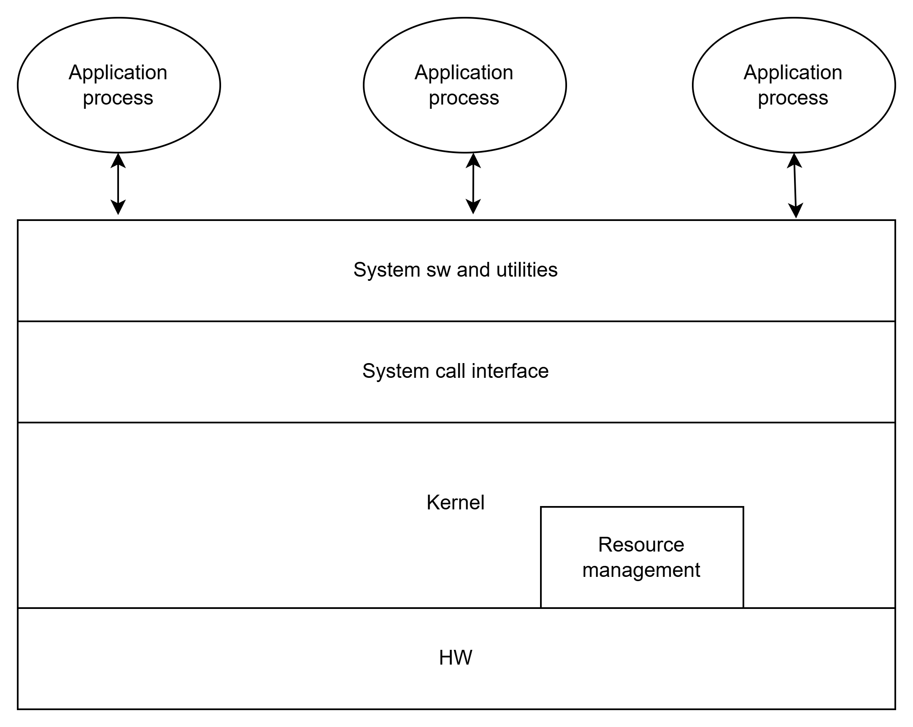

# 운영체제 역할

- user interface
- Resource Management (Hw, Sw resource)
- Process and Thread Management
- System Management

___

### 컴퓨터 시스템의 구성

#### OS 부분
- System Call Interface
    -  kernel에 필요한 기능을 요청하는 통로
    - 커널이 제공하는 기능중 사용자가 쓸 수 있는 것들을 모아둔 것

- kernel
    - 프로세스 관리, 메모리 관리, 저장장치 관리와 같은 핵심적인 기능을 한다.

___

### 운영체제의 구분

- 동시 사용자 수
    - single - user - system 
        - 한명의 사용자가 모든 시스템 독점
    -  multi - user - system 
        - 각종 자원에 대한 소유권 관리 필요
        - 멀티태스킹 필요
        - ex ) server, cluster

- 동시 실행 프로세스 수
    - 단일 작업 : 시스템 내 하나의 프로세스만 존재
    - 다중 작업 : 동시에 여러개 프로세스 수행가능

- 작업 수행 방식에 따른 os

- 순차처리
    - 운영체제 개념 존재하지 않음
    - 사용자가 기계어로 직접 프로그램 작성
    - 컴퓨터에 필요한 모든 작업 프로그램에 포함
    - 프로세서에는 명령어 저장 방법, 계산 대상, 결과 저장 위치와 방법, 출력 시점, 위치 등
    - 실행하는 작업 별 순차 처리
    - 각각의 작업에 대한 준비 시간이 소요

- 일괄 처리 시스템
    - 모든 시스템을 중앙(전자계산소 등)에서 관리 및 운영
    - 사용자의 요청 작업(천공카드 등)을 일정 시간 모아 두었
다가 한번에 처리
    - 시스템 지향적
    - 장점 : 많은 사용자가 시스템 자원 공유, 처리효율 상승
    - 단점 : 생산성 저하, 긴 응답시간간

- 시분할 시스템
    
    - 여러 사용자가 자원을 동시에 사용
    - 사용자 지향적
    - 장점 : 응답시간 단축, 생산성 향상
    - 단점 : 통신비용 증가, 개인관점 속도저하하

- Personal Computing
    - 개인이 시스템 전체 독점
    - cpu 활용율 고려 X
    - OS 단순
    - 장점 : 빠른 응답 시간
    - 단점 : 성능 낮음

- Parallel Processing System
    - 단일 시스템 내에서 둘 이상의 프로세서 사용
    - 메모리 등의 자원 공유
    - 성능향상, 신뢰성 향상
    - 프로세서간 관계 및 역할 관리 필요

- Distributed Processing System
    - 네트워크를 기반으로 구축된 병렬처리 시스템
    - 물리적인 분산, 통신망 이용한 연결
    - 분산운영체제를 이용해 하나의 프로그램처럼 사용가능
    - 각 구성간 독립성 유지, 공동작업 가능
    - 장점 : 자원 공유를 통한 높은 성능, 높은 확장성
    - 단점 : 구축 및 관리 어려움

- Real time System 
    - 작업처리에 제한시간을 갖는 시스템
    - Hard real-time-system : 시간제약 못지키면 큰일나는 시스팀
    - soft real-time-system : 동영상 재생 등..
___

### 운영체제의 구조

#### 커널
- OS의 핵심 부분 (메모리 상주)
    - 가장 빈번하게 사용되는 기능들 담당
    - 동의어 : 핵, 관리자 프로그램, 상주 프로그램, 제어 프로그램 등..

### 유틸리티
- 비상주 프로그램
- UI등 서비스 프로그램

### 단일구조 운영체제 

- 장점 : 커널 내 모듈간 직접 통신
- 단점 : 거대화 되었을 때 오류, 버그 유지보수 문제, 동일 메모리에 있어서 시스템 전체에 영향이 감

### 계층 구조 운영체제

- 장점 : 모듈화 , 검증 및 수정 요이, 설계구현 단순화
- 단점 : 단일 구조 대비 성능 낮음

### 마이크로 커널 구조

- 커널 크기 최소화
- 필수기능만 포함
- 기타기능은 사용자 영역에서 수행

___
### 운영체제 기능
- 프로세스 프로세서 관리
- 메모리, 파일, I/O 보조 기억장치 및 기타 주변장치 관리
