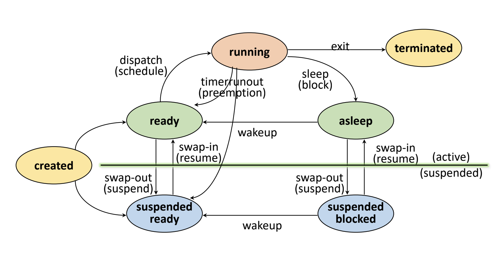
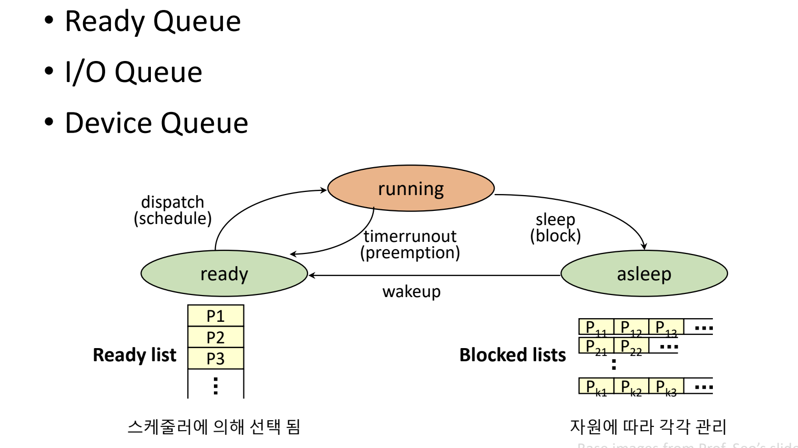

## 프로세스 관리

#### job , program : 실행할 데이터 + 프로그램, 컴퓨터 시스템에 실행 전 요청 단계
#### process : 실행을 위해 시스템에 등록 된 상태 , 커널에 의해 관리된다

### 프로세스 정의
- 커널에 등록되고 커널의 관리하에 있는 작업
- 각종 자원들을 요청하고 할당 받을 수 있는 개체
- 프로세스 관리 블록을 할당받은 개체
- 능동적인 개체 (실행 중 각종 자원을 요구, 할당 반납하며 진행)

### 프로세스 종류
- 역할로서의 프로세스
  - 시스템 프로세스
  - 사용자 프로세스

- 병행 수행 방법으로 프로세스
  - 독립 프로세스
  - 협력 프로세스

### 자원이란?
커널 관리 하에 프로세서에게 할당 / 반납 되는 수동적 개체 
H/W Resource -> processor ,memory, disk ... 
S/W Resource -> Message, signal, file ...

___

### PCB??
- OS가 프로세스 관리에 필요한 정보 저장
- 프로세스 생성시 생성된다

- 메모리 영역은 프로세스가 쓰는 공간과 커널 공간이 있으며 PCB는 커널 공간 내에 존재하고 프로세스가 생성 시 생성된다

### PCB가 관리하는 정보
- PID : 프로세스 고유 식별 번호
- 스케줄링 정보
- 프로세스 상태 
- 메모리 관리 정보
- 입출력 상태 정보
- 문맥 저장 영역
- 계정 정보

### 프로세스 상태

#### Create State
- 작업을 커널에 등록, pcb 할당 및 프로세스 생성
- 메모리가 있다면? -> Ready State
- 없다면 -> Suspended ready

#### Ready State
- 프로세서 외에 다른 모든 자원을 할당받은 상태(프로세서 할당대기, 즉시 실행 가능)
- CPU를 기다리다가(Ready) CPU 할당 받으면 -> Running State
- Dispatch 됐다고 함
- ready ->(dispatch) -> runnning

#### Running State
- 프로세서와 필요한 자원을 모두 할당받은 상태
- Preemption : running -> ready (타임아웃, 우선순위에 따라 cpu 빼앗김)
- Block / sleep : running -> asleep ( I/O 등 자원 할당을 요청하거나 메모리에서 데이터를 읽거나 써야 할 때 다른 프로세스가 CPU를 사용)

#### Block / Asleep State
- 프로세서 외 다른 자원을 기다리는 상태
- wake-up : asleep state -> ready state

#### Suspended State
- 메모리를 할당받지 못한 상태
- 메모리 이미지를 swap device에 보존한다
- 커널 또는 사용자에 의해 발생한다

#### Terminated / Zombie State
- 프로세스 수행이 끝난 상태
- 모든 자원 반납 후
- 커널 내 일부 pcb 정보만 남아있는 상태 
- running -> terminated

#### 프로세스 관리를 위한 자료구조

___

### 인터럽트란?
> 예상치 못한 , 외부에서 발생한 이벤트

#### 인터럽트 종류
- io interrupt
- clock interrupt
- console interrupt
- program check interrupt
- machine check interrupt
- inter-process interrupt
- system call interrupt

#### 인터럽트 처리 과정
- 인터럽트 발생 -> 프로세스 중단 ->
- 인터럽트 처리 (interrupt handling) ->
- 발생 장소, 원인파악 -> 인터럽트 서비스 할것인지 결정 -> 
- 인터럽트 서비스 루틴 호출

___

### Context Switching

- context : 프로세스와 관련된 정보들의 집합
- context saving : 현재 프로세스의 register context를 저장 하는 작업
- context restoring: register context를 프로세스로 복구하는 방법
- context switching : 실행중인 프로세스의 context를 저장하고 앞으로 실행할 프로세스의 context를 복구하는 일