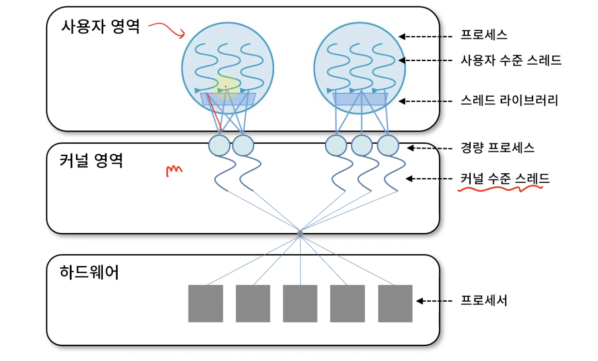

## 스레드  

#### 스레드란?
프로세스의 기본 실행 단위이다
프로세스 내부에는 스레드가 여러개 있다

Thread의 구성
- Program Counter
- Register set
- Stack Space

Thread의 공유부분
- Code Section
- Data Section
- OS Resource

#### 스레드의 장점
- 응답성, 스레드간의 작업 분할과 병렬처리로 빠른 응답 제공
- 자원 공유 효율 , 프로세스 두개가 같은 자원을 사용한다면 컨텍스트 스위칭 자주발생 -> 오베헤드 증가   스레드를 사용한다면 동시에 작업가능 컨텍스트 스위칭 발생 안함
- 경제성, 프로세스 대비 경제성 좋음
- 병렬처리 성능향상
___

#### 스레드의 구현
- 사용자 수준 스레드
  - 사용자 영역의 스레드 라이브러리로 구현됨
  - (posix thread, win32 thread, java thread api)
  - 커널은 스레드가 몇개 있는지 모름 (커널의 개입 x , 이식성이 높음)
  - 하나의 스레드가 block되면 모든 스레드가 대기
  - 다 대 일 모델

- 커널 수준 스레드
  - OS가 직접관리
  - 커널 영역에서 생성 , 관리, 오버헤드가 크다
  - 커널이 스레드 개별적 관리
  - 프로세스 내의 스레드들이 병행수행 가능
  - 일 대 일 모델

#### N : M 모델 (다중 스레드)
- n개의 사용자 수준 스레드 + m개의 커널 수준 스레드 n >= m
- 사용자가 원하는 만큼 스레드 생성
- 커널 스레드는 자신에게 할당된 사용자수준 스레드가 block되어도 다른 스레드 수행 가능
- 효율적이면서 유연하다
